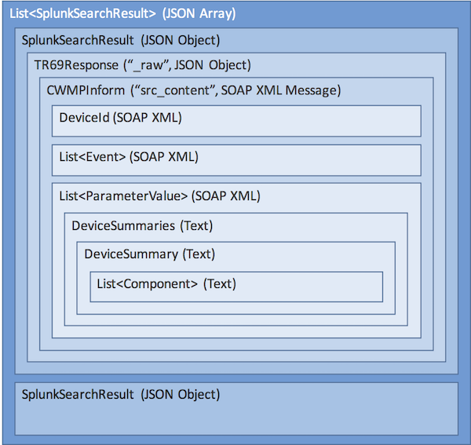

# TR-069 Protocol Format

TR-069 describes the CPE WAN Management Protocol, intended for communication between a CPE (customer-premises equipment or customer-provided equipment) and Auto-Configuration Server (ACS). The CPE WAN Management Protocol defines a mechanism that encompasses secure auto-configuration of a CPE, and also incorporates other CPE management functions into a common framework.

The CPE WAN Management Protocol is intended to support a variety of functionalities to manage a collection of CPE, including the following primary capabilities:

* Auto-configuration and dynamic service provisioning
* Software/firmware image management
* Software module management
* Status and performance monitoring
* Diagnostics

## Parsing the message from Splunk

Relevant data exists as fields and structured text within a field of a SOAP (XML) message, wrapped within a JSON response document, wrapped within Splunk search results, which can be delivered as JSON.

The data from Splunk can be parsed as follows:

    // instantiate parsers
    ObjectMapper mapper = new ObjectMapper();
    SoapParser soapParser = new SoapParser();
    DeviceSummaryParser summaryParser = new DeviceSummaryParser();

    // parse the top-level json
    List<SplunkSearchResult> searchResults = mapper.readValue(inputStream, new TypeReference<List<SplunkSearchResult>>(){});
    
    for (SplunkSearchResult result : searchResults) {
    
        // parse the second-level json
        TR69Response response = mapper.readValue(result.getRaw(), TR69Response.class);
        
        // parse the response headers
        InputStream stream = new ByteArrayInputStream(response.getSrcHeaders().getBytes(StandardCharsets.UTF_8));
        Map<String, String> headers = HttpHeaderParser.parseHTTPHeaders(stream);

        // decode the SOAP content from chunked transfer encoded text
        String xml = ChunkedDataParser.read(response.getSrcContent());

        // parse the SOAP content
        CWMPInform message = soapParser.getResult(xml, CWMPInform.class);
        
        // parse the structured text within one of the parameter values
        DeviceSummaries summaries = summaryParser.parse(message.getParameterValue("InternetGatewayDevice.DeviceSummary"));
        
        int ethernetLanStatus = summaries.getSummary("InternetGatewayDevice").getComponent("EthernetLAN").getStatus();
    }
